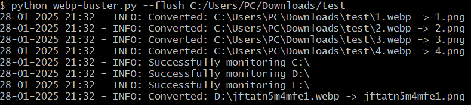

# webp-buster
Automatically replace incoming WebP files with PNG files continuously on specified paths or drives

# Usage
Usage: webp-buster.py [-h] [-d DEEP] [paths ...]

positional arguments:
  paths                 Paths to monitor (optional)

options:
  -h, --help            show this help message and exit
  -d DEEP, --deep DEEP  Directory to pre-convert WebP files

Usage examples:
python webp-buster.py (continuously monitor all drives for incoming webp's)
python webp-buster.py C:\\ D:\\  (monitor the C:\ and D:\ drives for incoming webp's)
python webp-buster.py C:\\Users\\PC\\Downloads\\  (only monitor this directory for incoming webp files)
python webp-buster.py C:\\Users\\PC\\Downloads\\ C:\\Users\\PC\\Pictures (monitor these two directories for incoming webp's)
python webp-buster.py --deep C:\\Users\\PC\\Downloads\\ (replace all webp's currently in the downloads folder) then monitor all drives for incoming webp's

Logging:
Logs outputs to stdout (console) and to a file located at ~/WebP_Converter_Logs

Example output:

